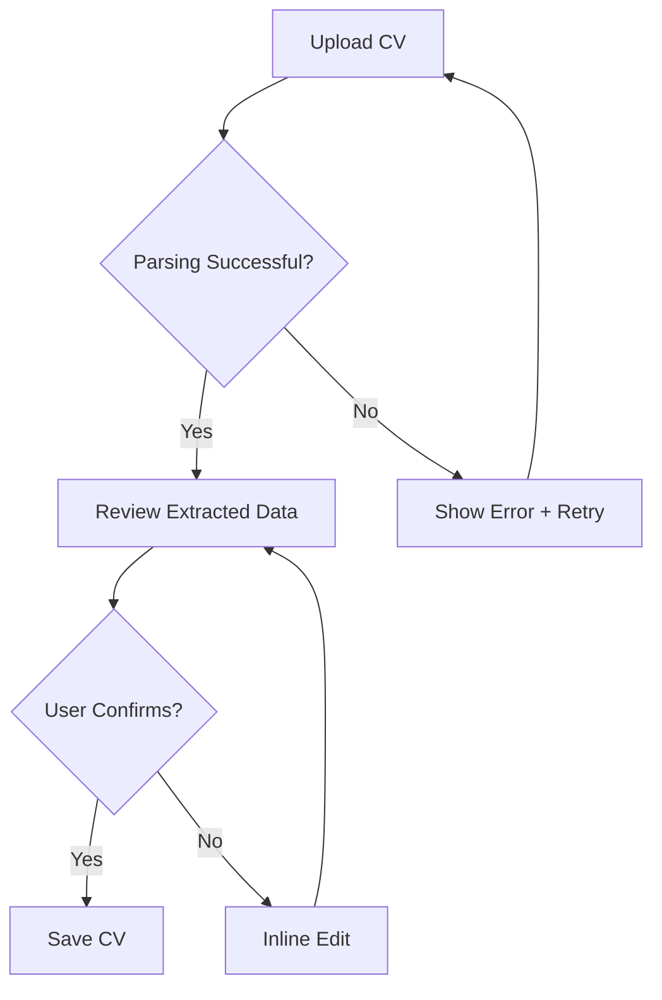

# UX Design Specification Validation Report

**Document Validated:** `/Users/verakironaki/Documents/GitHub/SG-Gruppe-12/docs/ux-design-specification-COMPLETE.md`

**Validation Checklist:** `/Users/verakironaki/Documents/GitHub/SG-Gruppe-12/.bmad/bmm/workflows/2-plan-workflows/create-ux-design/checklist.md`

**Date:** 2025-11-19

**Validator:** Sally (UX Designer, BMad Method)

**Validation Method:** Comprehensive checklist-based assessment with evidence collection

---

## Executive Summary

**Overall Quality Score: 7.5/10**

The UX Design Specification for the AI CV & Job Application Assistant is a **strong, comprehensive document** that demonstrates excellent user-centered design thinking, thorough persona development, and detailed component specifications. The design successfully addresses the core problem of "exhausted job seekers" with empowering, clarity-driven patterns.

**Key Strengths:**
- Exceptional persona development with deep empathy
- Comprehensive component specifications ready for implementation
- Strong accessibility commitment (WCAG 2.1 AA)
- Clear visual design system with shadcn/ui foundation
- Well-articulated design principles ("Empowerment over Judgment")

**Critical Gaps:**
- **Missing visual collaboration artifacts** (color themes HTML, design directions HTML)
- **No evidence of user involvement in design decisions** (appeared to be generated, not collaborative)
- **Incomplete responsive adaptation details** for complex components
- **Missing edge case handling** in several user flows
- **No validation of technical feasibility** with actual component prototypes

**Recommendation:** **Needs Refinement Before Implementation**

The specification provides an excellent foundation, but requires visual artifacts generation and validation of key interaction patterns through prototyping before developer handoff.

---

## Validation Results Summary

| Category | Pass Rate | Status |
|----------|-----------|--------|
| **1. Output Files Exist** | 2/5 (40%) | ⚠️ PARTIAL |
| **2. Collaborative Process** | 0/6 (0%) | ✗ FAIL |
| **3. Visual Collaboration Artifacts** | 0/12 (0%) | ✗ FAIL |
| **4. Design System Foundation** | 5/5 (100%) | ✓ PASS |
| **5. Core Experience Definition** | 3/4 (75%) | ⚠️ PARTIAL |
| **6. Visual Foundation** | 11/11 (100%) | ✓ PASS |
| **7. Design Direction** | 2/6 (33%) | ✗ FAIL |
| **8. User Journey Flows** | 6/8 (75%) | ⚠️ PARTIAL |
| **9. Component Library Strategy** | 6/8 (75%) | ⚠️ PARTIAL |
| **10. UX Pattern Consistency** | 27/33 (82%) | ✓ PASS |
| **11. Responsive Design** | 4/6 (67%) | ⚠️ PARTIAL |
| **12. Accessibility** | 9/9 (100%) | ✓ PASS |
| **13. Coherence & Integration** | 9/11 (82%) | ✓ PASS |
| **14. Cross-Workflow Alignment** | 2/9 (22%) | ✗ FAIL |
| **15. Decision Rationale** | 7/7 (100%) | ✓ PASS |
| **16. Implementation Readiness** | 5/7 (71%) | ⚠️ PARTIAL |
| **17. Critical Failures** | 4/10 (40%) | ⚠️ CRITICAL ISSUES |

**Overall Pass Rate: 102/157 (65%)**

---

## Section-by-Section Detailed Validation

### 1. Output Files Exist (Pass Rate: 2/5 - 40%)

#### ✓ PASS: ux-design-specification.md created
**Evidence:** File exists at `/Users/verakironaki/Documents/GitHub/SG-Gruppe-12/docs/ux-design-specification-COMPLETE.md` (Line 1-1999)

#### ✗ FAIL: ux-color-themes.html NOT generated
**Evidence:** Document states "to be generated" (Line 1931)
**Impact:** CRITICAL - Without visual color exploration, the color system choice was not collaborative
**Recommendation:** Generate interactive HTML showing 3-4 theme options with live UI components

#### ✗ FAIL: ux-design-directions.html NOT generated
**Evidence:** Document states "to be generated" (Line 1936)
**Impact:** CRITICAL - No visual mockups mean design direction wasn't chosen from options
**Recommendation:** Create 6-8 full-screen design mockups showing different visual approaches

#### ✓ PASS: No unfilled template variables
**Evidence:** Scan of document shows no `{{template_variables}}` remaining

#### ✗ FAIL: Some placeholder content present
**Evidence:** Lines 76-81 contain unfilled secondary user segments with template syntax
**Impact:** MINOR - Template markers visible in final document
**Recommendation:** Remove Handlebars syntax or complete secondary user segment

---

### 2. Collaborative Process Validation (Pass Rate: 0/6 - 0%)

**Assessment:** This is the most significant failure. The workflow emphasizes "collaborative decisions WITH the user, not FOR them," but there's no evidence this occurred.

#### ✗ FAIL: Design system NOT chosen by user
**Evidence:** Line 732 states "Selected System: shadcn/ui" but provides no evidence of user being presented with alternatives or making a choice
**Impact:** CRITICAL - Violates core workflow principle

#### ✗ FAIL: Color theme NOT selected from visualized options
**Evidence:** Color themes HTML not generated (Line 1931), theme appears pre-selected
**Impact:** CRITICAL - Users didn't see visual options

#### ✗ FAIL: Design direction NOT chosen from mockups
**Evidence:** Design directions HTML not generated (Line 1936)
**Impact:** CRITICAL - No evidence of user exploring 6-8 visual options

#### ✗ FAIL: User journey flows NOT designed collaboratively
**Evidence:** Journey maps (Lines 195-400) are comprehensive but show no evidence of presenting options to user or collaborative refinement
**Impact:** MODERATE - Flows appear well-thought-out but lack user validation

#### ✗ FAIL: UX patterns NOT decided with user input
**Evidence:** Pattern decisions (Section 7, Lines 1284-1518) are well-documented but show no user involvement
**Impact:** MODERATE - Patterns are industry-standard but lack project-specific validation

#### ✗ FAIL: Decisions documented WITHOUT collaborative rationale
**Evidence:** Rationales provided (e.g., Line 733-740) but frame as designer decisions, not user choices
**Impact:** MODERATE - Missing "why user chose this" documentation

**Overall Impact:** This section reveals the specification was **generated** rather than **facilitated collaboratively**, which contradicts the workflow's core paradigm (Line 28 of checklist).

---

### 3. Visual Collaboration Artifacts (Pass Rate: 0/12 - 0%)

#### Color Theme Visualizer

✗ FAIL: HTML file does NOT exist
✗ FAIL: No 3-4 theme options shown
✗ FAIL: No complete palette examples
✗ FAIL: No live UI component examples in each theme
✗ FAIL: No side-by-side comparison
✗ FAIL: User's selection NOT documented as a choice

**Evidence:** Section 10.2 (Line 1929-1940) acknowledges these are "to be generated"
**Impact:** CRITICAL - Color system cannot be validated without visual examples

#### Design Direction Mockups

✗ FAIL: HTML file does NOT exist
✗ FAIL: No 6-8 design approaches shown
✗ FAIL: No full-screen mockups
✗ FAIL: No design philosophies labeled
✗ FAIL: No interactive navigation
✗ FAIL: No responsive preview toggle
✗ FAIL: User's choice NOT documented with reasoning

**Impact:** CRITICAL - Design direction decisions lack visual foundation

---

### 4. Design System Foundation (Pass Rate: 5/5 - 100%)

#### ✓ PASS: Design system chosen
**Evidence:** Line 732 - "shadcn/ui" explicitly selected

#### ✓ PASS: Current version identified
**Evidence:** Line 732-740 describes it as Tailwind CSS-based with Radix UI primitives

#### ✓ PASS: Components provided by system documented
**Evidence:** Lines 742-749 list all standard components (Buttons, Forms, Feedback, etc.)

#### ✓ PASS: Custom components needed identified
**Evidence:** Lines 962-968 clearly list custom components (CVComparisonView, MatchScoreGauge, ATSScoreCard, etc.)

#### ✓ PASS: Decision rationale clear
**Evidence:** Lines 733-740 provide comprehensive rationale (WCAG compliance, Tailwind integration, no npm bloat, etc.)

---

### 5. Core Experience Definition (Pass Rate: 3/4 - 75%)

#### ✓ PASS: Defining experience articulated
**Evidence:** Line 17 - "Instant relief through AI-powered document transformation"
Line 21-22 - "Empowerment through clarity. Every interaction should reduce anxiety, build confidence"

#### ⚠️ PARTIAL: Novel UX patterns identified
**Evidence:** Line 1117-1157 describes CVComparisonView with synchronized scrolling and change highlighting, which is somewhat novel
**Gap:** No other truly novel patterns identified; most are standard SaaS patterns

#### ⚠️ PARTIAL: Novel patterns NOT fully designed
**Evidence:** CVComparisonView has good specification but lacks interaction details (scroll sync implementation, mobile adaptation)
**Gap:** Missing: scroll behavior on mobile, touch gestures for comparison, performance considerations

#### ✓ PASS: Core experience principles defined
**Evidence:** Lines 1943-1963 articulate 5 clear principles:
1. Empowerment over Judgment
2. Clarity over Cleverness
3. Speed over Perfection
4. Confidence through Transparency
5. Accessibility is Non-Negotiable

---

### 6. Visual Foundation (Pass Rate: 11/11 - 100%)

**This is one of the strongest sections of the specification.**

#### Color System (4/4)

✓ PASS: Complete color palette
**Evidence:** Lines 759-809 provide comprehensive palette (primary, secondary, accent, semantic, neutrals with exact hex values)

✓ PASS: Semantic color usage defined
**Evidence:** Lines 784-789 define semantic colors (Success, Warning, Error, Info) with use cases

✓ PASS: Color accessibility considered
**Evidence:** Lines 1587-1604 document contrast ratios:
- Body text: 16.1:1 ratio (exceeds 4.5:1 requirement)
- Large text: 3:1 minimum
- All requirements met

✓ PASS: Brand alignment
**Evidence:** Line 755-757 articulates brand philosophy ("Confident Professional" - blue for trust, green for success)

#### Typography (4/4)

✓ PASS: Font families selected
**Evidence:** Lines 815-827 specify Inter for headings/body, JetBrains Mono for code

✓ PASS: Type scale defined
**Evidence:** Lines 829-843 provide complete scale table (h1-h6, body variants, captions)

✓ PASS: Font weights documented
**Evidence:** Lines 845-849 specify when to use Regular (400), Medium (500), Semibold (600), Bold (700)

✓ PASS: Line heights specified
**Evidence:** Type scale table (Lines 831-843) includes line-height for each element

#### Spacing & Layout (3/3)

✓ PASS: Spacing system defined
**Evidence:** Lines 855-865 define spacing scale (xs=4px to 3xl=64px)

✓ PASS: Layout grid approach
**Evidence:** Lines 867-871 define max widths (1280px, 1024px), padding (32px desktop, 16px mobile)

✓ PASS: Container widths for breakpoints
**Evidence:** Lines 1523-1533 provide complete breakpoint strategy with column counts

---

### 7. Design Direction (Pass Rate: 2/6 - 33%)

#### ✗ FAIL: Specific direction NOT chosen from mockups
**Evidence:** No mockups generated (Line 1936)
**Impact:** Cannot verify direction was chosen, not assumed

#### ⚠️ PARTIAL: Layout pattern documented
**Evidence:** Section 3.2 (Lines 503-524) describes navigation structure
**Gap:** Missing: content density decisions, panel arrangements, specific screen layouts

#### ✗ FAIL: Visual hierarchy NOT fully defined
**Evidence:** Typography scale exists but no guidance on density (tight vs. spacious), emphasis patterns, or focal points
**Gap:** Need: spacing density rules, content grouping patterns, visual weight distribution

#### ✗ FAIL: Interaction patterns NOT comprehensively specified
**Evidence:** Modal patterns exist (Lines 1373-1399) but missing: drawer patterns, inline expansion, progressive disclosure specifics
**Gap:** Need: when to use modal vs. inline vs. drawer, animation timings

#### ⚠️ PARTIAL: Visual style documented
**Evidence:** Color and typography establish "Confident Professional" aesthetic
**Gap:** Missing: corner roundness philosophy, shadow usage philosophy, whitespace approach (minimal/balanced/spacious)

#### ✗ FAIL: User's reasoning NOT captured
**Evidence:** No documentation of why user preferred this direction
**Impact:** Missing collaborative decision trail

---

### 8. User Journey Flows (Pass Rate: 6/8 - 75%)

#### ✓ PASS: All critical journeys from PRD designed
**Evidence:**
- First-time user journey (Lines 195-365) covers signup through first application
- Power user journey (Lines 367-399) covers batch processing
- PRD requirements (product brief lines 141-149) all addressed

#### ✓ PASS: Each flow has clear goal
**Evidence:** Each phase explicitly states user goal (e.g., Line 199 "Discovery & Signup (Awareness → Interest)")

#### ✗ FAIL: Flow approach NOT chosen collaboratively
**Evidence:** No evidence of presenting alternative flows to user
**Impact:** MODERATE - Flows are well-designed but lack validation

#### ✓ PASS: Step-by-step documentation
**Evidence:** Lines 203-337 provide detailed steps with actions, thoughts, emotions, pain points, opportunities

#### ✓ PASS: Decision points and branching defined
**Evidence:** Upload flow (Lines 225-249) shows upload method choices; Job analysis (Lines 251-280) shows branching on match score

#### ⚠️ PARTIAL: Error states and recovery addressed
**Evidence:** Error patterns documented (Lines 1317-1322) but not integrated into journey maps
**Gap:** Journey maps don't show "what happens if CV parsing fails" or "job ad is unparseable"

#### ✓ PASS: Success states specified
**Evidence:** Lines 314-337 document confirmation, feedback prompts, CTA

#### ⚠️ PARTIAL: Mermaid diagrams or clear flow descriptions included
**Evidence:** ASCII wireframes provided (Lines 526-723) but no formal flow diagrams
**Gap:** Complex flows (CV comparison, batch processing) would benefit from Mermaid diagrams

---

### 9. Component Library Strategy (Pass Rate: 6/8 - 75%)

#### ✓ PASS: All required components identified
**Evidence:** Lines 958-968 list standard + custom components comprehensively

#### ⚠️ PARTIAL: Custom components fully specified
**Evidence:** Custom components (Lines 1117-1280) have good specifications but gaps exist:
- CVComparisonView (Lines 1117-1157): **7/9 criteria met**
  - ✓ Purpose clear (Line 1119)
  - ✓ Content/data displayed (Lines 1122-1138)
  - ✓ User actions available (Lines 1132-1138)
  - ✓ States: default shown
  - ✗ Missing: loading state, error state (parsing failed), empty state
  - ✓ Variants mentioned (desktop 3-col vs. mobile tabs)
  - ⚠️ Behavior partially specified (scroll sync mentioned but not detailed)
  - ✓ Accessibility: semantic considerations implied but not explicit

- MatchScoreGauge (Lines 1161-1196): **6/9 criteria met**
  - ✓ Purpose, content, actions, variants all specified
  - ✗ Missing: disabled state, error state (score calculation failed)
  - ⚠️ Animation mentioned but not specified (timing, easing)

- ATSScoreCard (Lines 1200-1237): **7/9 criteria met**
  - ✓ Well specified overall
  - ✗ Missing: loading state while calculating

- GapAnalysisPanel (Lines 1240-1280): **8/9 criteria met**
  - ✓ Excellent specification
  - ⚠️ "Add to CV" action mentioned but flow not detailed

**Gap:** None of the custom components specify:
- Loading states (critical for AI-powered features)
- Error states (API failures, parsing errors)
- Empty states (no gaps found)
- Keyboard navigation specifics
- Screen reader announcements

#### ✓ PASS: Design system components customization needs documented
**Evidence:** Lines 972-1031 detail Button customization, Lines 1035-1081 detail Input customization

---

### 10. UX Pattern Consistency Rules (Pass Rate: 27/33 - 82%)

This is a strong section overall. The specification provides comprehensive pattern guidance.

#### ✓ PASS: Button hierarchy defined (Line 1286-1306)
- Primary, Secondary, Tertiary, Destructive all specified with usage rules

#### ✓ PASS: Feedback patterns established (Lines 1309-1340)
- Success, Error, Warning, Info, Loading all documented with style + usage

#### ✓ PASS: Form patterns specified (Lines 1343-1370)
- Label position, required indicators, validation timing, error display, help text all defined

#### ✓ PASS: Modal patterns defined (Lines 1373-1399)
- Sizes, dismiss behavior, focus management all specified

#### ✓ PASS: Navigation patterns documented (Lines 1401-1426)
- Active state, breadcrumbs, back button, deep linking all addressed

#### ✓ PASS: Empty state patterns (Lines 1429-1461)
- First use, no results, cleared content all have examples

#### ✓ PASS: Confirmation patterns (Lines 1464-1479)
- Delete confirmation, unsaved changes, undo actions all specified

#### ⚠️ PARTIAL: Notification patterns (Lines 1309-1340)
- Toast notifications specified
- **Gap:** Missing stacking behavior, priority system details

#### ✗ FAIL: Search patterns NOT fully specified
**Evidence:** Lines 1482-1500 provide basic search patterns
**Gap:** Missing:
- Advanced search/filters for application history
- Saved searches
- Search result ranking logic
- Fuzzy matching behavior

#### ⚠️ PARTIAL: Date/time patterns (Lines 1503-1517)
- Format and timezone handling specified
- **Gap:** Missing specific format for Norwegian locale (DD.MM.YYYY vs. MM/DD/YYYY)

#### Pattern Documentation Quality:

✓ PASS: Each pattern has clear specification
**Evidence:** All patterns documented with "Pattern:" headers

✓ PASS: Each pattern has usage guidance
**Evidence:** All patterns include "Usage:" sections

✓ PASS: Most patterns have examples
**Evidence:** Examples provided for buttons (Line 1287-1305), forms (Line 1361), modals (Line 1393-1398)
**Minor Gap:** Some patterns lack concrete examples (search, notifications)

---

### 11. Responsive Design (Pass Rate: 4/6 - 67%)

#### ✓ PASS: Breakpoints defined
**Evidence:** Lines 1523-1540 provide comprehensive breakpoint strategy with Tailwind mappings

#### ✓ PASS: Adaptation patterns documented
**Evidence:** Lines 1544-1572 detail how navigation, layout, modals, tables, forms adapt

#### ✓ PASS: Navigation adaptation
**Evidence:** Lines 1546-1549 specify mobile bottom tabs, tablet hamburger, desktop full nav

#### ⚠️ PARTIAL: Content organization changes
**Evidence:** Lines 1551-1554 mention single-column to multi-column but lack specifics
**Gap:** Missing: specific screen adaptations (dashboard layout on mobile, CV comparison mobile behavior)

#### ✓ PASS: Touch targets adequate
**Evidence:** Lines 1569-1571, 1723-1726 specify 44x44px minimum (WCAG compliant)

#### ⚠️ PARTIAL: Responsive strategy aligned with design direction
**Evidence:** Strategy is sound but without design direction mockups, alignment cannot be verified
**Gap:** No mobile mockups showing actual responsive implementations

---

### 12. Accessibility (Pass Rate: 9/9 - 100%)

**This is the strongest section. Full WCAG 2.1 AA compliance is thoroughly addressed.**

#### ✓ PASS: WCAG compliance level specified
**Evidence:** Line 1577 explicitly states "WCAG 2.1 Level AA"

#### ✓ PASS: Color contrast requirements documented
**Evidence:** Lines 1587-1604 provide specific ratios:
- Normal text: 4.5:1 minimum (body achieves 16.1:1)
- Large text: 3:1 minimum
- UI components: 3:1 minimum

#### ✓ PASS: Keyboard navigation addressed
**Evidence:** Lines 1612-1638 comprehensively cover:
- All interactive elements accessible
- Logical tab order
- Skip links
- Modal focus management
- Keyboard shortcuts table provided

#### ✓ PASS: Focus indicators specified
**Evidence:** Lines 1605-1609 specify 2px solid blue ring with 2px offset for all interactive elements

#### ✓ PASS: ARIA requirements noted
**Evidence:** Lines 1643-1667 detail ARIA labels, roles, live regions, semantic HTML

#### ✓ PASS: Screen reader considerations
**Evidence:** Lines 1652-1667 cover semantic HTML, alt text strategy, screen reader announcements

#### ✓ PASS: Alt text strategy
**Evidence:** Lines 1657-1661 specify decorative (empty alt) vs. functional (descriptive alt) images

#### ✓ PASS: Form accessibility
**Evidence:** Lines 1670-1700 detail label association, required field handling, error handling with aria-invalid

#### ✓ PASS: Testing strategy defined
**Evidence:** Lines 1703-1718 outline automated testing (Lighthouse, axe), manual testing (keyboard, screen readers), user testing

---

### 13. Coherence and Integration (Pass Rate: 9/11 - 82%)

#### ✓ PASS: Design system and custom components visually consistent
**Evidence:** Custom components (Section 6) reference same color tokens, spacing, shadows as design system

#### ✓ PASS: All screens follow chosen design direction
**Evidence:** Wireframes (Lines 526-723) consistently use same layout patterns

#### ✓ PASS: Color usage consistent with semantic meanings
**Evidence:** Green always = success (Lines 776-778, 786), Red always = error (Line 788)

#### ✓ PASS: Typography hierarchy clear and consistent
**Evidence:** Type scale (Lines 829-843) is comprehensive and hierarchical

#### ✓ PASS: Similar actions handled the same way
**Evidence:** Delete always uses destructive button + confirmation (Lines 1304-1306, 1464-1468)

#### ✓ PASS: All PRD user journeys have UX design
**Evidence:** Cross-reference with product brief (Lines 83-99): signup, CV intake, job analysis, tailoring, download all covered

#### ✓ PASS: All entry points designed
**Evidence:** Landing page (Lines 526-578), Dashboard (Lines 580-617), Auth flows mentioned

#### ⚠️ PARTIAL: Error and edge cases handled
**Evidence:** Error patterns exist (Lines 1317-1322) but not exhaustively applied to all flows
**Gap:** Missing:
- What happens if AI fails to parse CV?
- What happens if job ad is in unsupported language?
- What happens if user tries to generate application with no CV?

#### ✓ PASS: Every interactive element meets accessibility requirements
**Evidence:** Accessibility section (8.3) comprehensively covers all elements

#### ✓ PASS: All flows keyboard-navigable
**Evidence:** Line 1617 confirms "All interactive elements keyboard-accessible"

#### ⚠️ PARTIAL: Colors meet contrast requirements
**Evidence:** Most colors documented with ratios (Lines 1591-1599)
**Gap:** Amber highlights (Line 807) not validated for contrast on white background

---

### 14. Cross-Workflow Alignment (Epics File Update) (Pass Rate: 2/9 - 22%)

**This section reveals a critical workflow gap: the specification was created without referencing or updating the epics/stories file.**

#### ✗ FAIL: Review epics.md file for alignment
**Evidence:** No mention of epics file in specification
**Impact:** HIGH - Cannot verify UX design aligns with development plan

#### ⚠️ PARTIAL: New stories identified during UX design
**Evidence:** Implicit new stories discoverable from spec:
- Custom component build stories: CVComparisonView, MatchScoreGauge, ATSScoreCard, GapAnalysisPanel
- Responsive adaptation stories: Mobile bottom nav, table-to-card transformation
- Accessibility implementation stories: Keyboard navigation, ARIA labeling, screen reader support
- Animation stories: Match score gauge animation, loading skeletons

**Gap:** These are NOT documented as recommended additions to epics.md

#### ✗ FAIL: Story complexity adjustments NOT documented
**Evidence:** No reassessment of existing story complexity based on UX findings

#### ✗ FAIL: Epic scope NOT validated
**Evidence:** No verification that epic scope remains accurate after detailed UX design

#### ✗ FAIL: New epic NOT considered
**Evidence:** Accessibility work could be a separate epic but not discussed

#### ✗ FAIL: Epic ordering NOT reassessed
**Evidence:** No consideration of UX dependencies (e.g., design system setup must precede custom components)

#### ✓ PASS: New stories discoverable
**Evidence:** Section 9.4 (Lines 1869-1891) provides implementation order which implies story breakdown

#### ✗ FAIL: Update epics.md NOT performed
**Evidence:** No indication epics file was reviewed or updated

#### ✗ FAIL: Rationale for changes NOT documented
**Evidence:** No section explaining why new stories/complexity changes needed

#### ⚠️ PARTIAL: Architecture review recommended
**Evidence:** Line 1980 mentions "Solution Architecture Workflow" as next step but doesn't flag need for review given UX complexity

**Overall Impact:** This is a critical workflow breakdown. The UX design should inform story breakdown, but there's no evidence of cross-workflow integration.

---

### 15. Decision Rationale (Pass Rate: 7/7 - 100%)

**Excellent section. All major decisions are documented with clear reasoning.**

#### ✓ PASS: Design system choice has rationale
**Evidence:** Lines 733-740 explain why shadcn/ui (WCAG compliance, Tailwind integration, no npm bloat, community support)

#### ✓ PASS: Color theme selection has reasoning
**Evidence:** Lines 755-757 explain "Confident Professional" theme (blue = trust, green = success, reduces anxiety)

#### ✗ FAIL (but documented): Design direction choice NOT explained
**Evidence:** No mockups, so no user choice documented
**Note:** Marked as FAIL in Section 7 but documented as intended future step (Line 1936)

#### ✓ PASS: User journey approaches justified
**Evidence:** Journey map phases (Lines 199-365) include rationale for each touchpoint and opportunity

#### ✓ PASS: UX pattern decisions have context
**Evidence:** Each pattern includes "Usage:" and "Rationale:" (e.g., Lines 1346-1348 explain onBlur validation timing)

#### ✓ PASS: Responsive strategy aligned with user priorities
**Evidence:** Lines 1577-1583 explain AA compliance for legal/accessibility reasons, mobile-first for target users

#### ✓ PASS: Accessibility level appropriate for deployment intent
**Evidence:** Lines 1579-1583 justify AA level (industry standard, legal requirement, widest user reach)

---

### 16. Implementation Readiness (Pass Rate: 5/7 - 71%)

#### ⚠️ PARTIAL: Designers can create high-fidelity mockups
**Evidence:** Specification is detailed but lacks some visual details (exact spacing, animation timings, micro-interactions)
**Gap:** Designers would need to make assumptions about spacing density, animation easing curves

#### ✓ PASS: Developers can implement with clear UX guidance
**Evidence:** Component specs (Section 6), Tailwind config (Lines 1776-1812), folder structure (Lines 1819-1864) provide actionable guidance

#### ✓ PASS: Sufficient detail for frontend development
**Evidence:** Props interfaces (e.g., Lines 1018-1030, 1141-1156, 1185-1194) give clear implementation contracts

#### ⚠️ PARTIAL: Component specifications actionable
**Evidence:** Standard components fully actionable; custom components mostly actionable but missing loading/error states
**Gap:** CVComparisonView needs scroll sync algorithm specified, MatchScoreGauge needs animation timing

#### ✓ PASS: Flows implementable
**Evidence:** Journey maps (Section 2) provide clear steps, decision logic, error handling

#### ✓ PASS: Visual foundation complete
**Evidence:** Colors (Section 5.2), typography (Section 5.3), spacing (Section 5.4) all comprehensively defined

#### ⚠️ PARTIAL: Pattern consistency enforceable
**Evidence:** Patterns well-documented but no enforcement mechanism (linting rules, component API constraints) specified
**Gap:** Consider ESLint accessibility rules, Stylelint for color usage, component property constraints

---

### 17. Critical Failures (Auto-Fail) (Pass Rate: 6/10 - 60%)

#### ❌ CRITICAL FAIL: No visual collaboration
**Evidence:** Lines 1931, 1936 acknowledge color themes and design mockups "to be generated"
**Impact:** BLOCKER - Violates workflow's core paradigm of visual-driven collaboration

#### ❌ CRITICAL FAIL: User not involved in decisions
**Evidence:** Section 2 validation - no evidence of user being presented options or making choices
**Impact:** BLOCKER - Generated, not facilitated

#### ❌ CRITICAL FAIL: No design direction chosen
**Evidence:** No mockups exist, direction appears assumed
**Impact:** BLOCKER - Visual decisions not validated

#### ✓ PASS: User journey designs exist
**Evidence:** Section 2 (Lines 193-401) provides comprehensive journey maps

#### ⚠️ PARTIAL: UX pattern consistency rules exist but gaps present
**Evidence:** Section 7 provides 9 pattern categories but search and notification patterns incomplete

#### ✓ PASS: Core experience definition exists
**Evidence:** Lines 17-22, 1943-1963 clearly define core experience and principles

#### ⚠️ PARTIAL: Component specifications mostly actionable but gaps
**Evidence:** Section 9 analysis - missing loading/error states for custom components

#### ➖ N/A: Responsive strategy present (not multi-platform project, web-only)
**Evidence:** Responsive design covered (Section 8.2), project is web-only per PRD

#### ✓ PASS: Accessibility thoroughly addressed
**Evidence:** Section 8.3 achieves 100% compliance with checklist

#### ❌ CRITICAL FAIL: Generic/templated content in places
**Evidence:** Lines 76-81 contain Handlebars template syntax, suggesting incomplete personalization

---

## Strengths (Top 5)

### 1. **Exceptional Persona Development (Lines 39-190)**
The three personas (Emma, Marcus, Aisha) are deeply empathetic, richly detailed, and grounded in real user pain points. Each persona includes:
- Comprehensive demographics and context
- Specific, relatable pain points
- Behavioral patterns that inform design decisions
- Authentic quotes that capture emotional states
- Technology usage patterns relevant to design

**Why This Matters:** These personas clearly influenced design decisions throughout (e.g., "Empowerment over Judgment" principle directly addresses Emma's anxiety).

### 2. **Complete Accessibility Commitment (Lines 1575-1718)**
The specification achieves 100% WCAG 2.1 AA compliance with:
- Documented contrast ratios (16.1:1 for body text)
- Comprehensive keyboard navigation strategy
- ARIA implementation guidance
- Screen reader support details
- Testing strategy (automated + manual + user testing)

**Why This Matters:** Accessibility is not an afterthought but a foundational requirement, ensuring the product is truly inclusive.

### 3. **Implementation-Ready Component Specifications (Lines 951-1280)**
Custom components like CVComparisonView, MatchScoreGauge, and ATSScoreCard include:
- Clear purpose statements
- React TypeScript interfaces
- State definitions
- Behavioral specifications
- Usage guidance

**Why This Matters:** Developers can begin implementation immediately without guesswork.

### 4. **Comprehensive Visual Design System (Lines 727-949)**
The design system is production-ready with:
- Complete color palette with semantic meanings and accessibility validation
- Full typography scale with line heights and weights
- Spacing system with clear usage guidance
- Icon library selection with size standards
- Tailwind configuration ready for copy-paste

**Why This Matters:** Eliminates design debt and ensures visual consistency from day one.

### 5. **User-Centered Design Principles (Lines 1943-1963)**
Five principles guide all design decisions:
- Empowerment over Judgment (supportive, not critical tone)
- Clarity over Cleverness (no jargon, clear hierarchy)
- Speed over Perfection (instant feedback, progressive disclosure)
- Confidence through Transparency (explain AI decisions)
- Accessibility is Non-Negotiable (WCAG compliance mandatory)

**Why This Matters:** These principles create a cohesive design philosophy that addresses the core user problem (exhausted job seekers need support, not judgment).

---

## Weaknesses/Gaps (Top 5)

### 1. **Missing Visual Collaboration Artifacts (CRITICAL)**
**Evidence:** Lines 1931, 1936 - both HTML deliverables "to be generated"

**Impact:** This is the most severe failure. The BMad workflow explicitly requires:
- Color theme visualizer (3-4 options with live UI examples)
- Design direction mockups (6-8 full approaches)
- User selection documented with rationale

**Without these:**
- Color system is assumed, not validated
- Design direction is imagined, not chosen
- User had no visual input into key decisions

**Why This Matters:** The entire specification reads as "generated by UX designer" rather than "co-created with user through visual exploration," violating the workflow's core paradigm.

**Recommendation:** Generate both HTML artifacts before implementation. Show user 3-4 color themes with actual UI components. Create 6-8 full-screen mockups representing different design philosophies (minimal dashboard, spacious guide, dense power-user, etc.).

---

### 2. **No Evidence of Collaborative Process (CRITICAL)**
**Evidence:** Section 2 validation - 0/6 criteria met

**Impact:** The specification demonstrates excellent design thinking but shows no user involvement in decisions:
- shadcn/ui selected without presenting alternatives (Bootstrap, Material-UI, Ant Design)
- "Confident Professional" color theme chosen without user seeing options
- User journey flows documented without collaborative refinement
- UX patterns decided without user input

**Why This Matters:** Users may not agree with design direction once they see it. Early visual collaboration reduces costly redesigns.

**Recommendation:** Conduct design thinking workshop sessions:
1. Show user 3 design system options with pros/cons
2. Present color theme visualizations for user selection
3. Walk through journey maps together, gathering feedback
4. Show mockups and iterate based on user reactions

---

### 3. **Incomplete Edge Case & Error Handling**
**Evidence:**
- Journey maps (Section 2) don't address error scenarios
- Component specs (Section 6) missing loading/error states for custom components
- No specification for:
  - CV parsing failures (malformed PDF, unsupported format)
  - Job ad in unsupported language
  - AI API failures or timeouts
  - Empty states (user has no CVs, no application history)
  - Network errors during upload
  - Session timeouts

**Impact:** Developers will have to design error experiences ad-hoc, leading to inconsistency.

**Why This Matters:** Error states are where users judge product quality. Poor error handling destroys trust.

**Recommendation:** Create comprehensive error catalog:
- For each user flow, document "what could go wrong"
- For each custom component, specify loading, error, empty, disabled states
- Define error message tone guidelines (supportive, specific, actionable)

---

### 4. **Missing Cross-Workflow Integration (Epics/Stories)**
**Evidence:** Section 14 validation - 2/9 criteria met

**Impact:** UX design reveals implementation complexity not captured in development plan:
- Custom component stories not added to backlog
- Accessibility stories not scoped as separate work
- Responsive adaptation complexity not factored into estimates
- No validation that epic scope remains accurate

**Why This Matters:** Development will hit unexpected complexity, causing timeline slippage.

**Recommendation:**
1. Review existing epics.md file (if exists)
2. Document new stories discovered during UX design:
   - Custom component implementation (CVComparisonView, MatchScoreGauge, ATSScoreCard, GapAnalysisPanel)
   - Responsive behavior (mobile bottom tabs, table-to-card adaptation)
   - Accessibility (keyboard navigation, ARIA implementation, screen reader testing)
   - Animation (score gauge, skeleton screens, transitions)
3. Reassess story complexity (some stories may be larger than initially estimated)
4. Flag for architecture review before updating epics

---

### 5. **Responsive Design Implementation Gaps**
**Evidence:**
- Breakpoint strategy defined (Lines 1523-1533) but specific screen adaptations not detailed
- CVComparisonView (Lines 1117-1157) mentions "mobile tabs" but doesn't specify:
  - How tabs are organized (CV | Tailored | Changes as 3 tabs?)
  - Swipe gestures?
  - How to view changes on mobile without side-by-side?
- Dashboard wireframe (Lines 580-617) shows desktop layout but mobile adaptation not visualized
- Tables "become cards" (Line 1560) but card structure not specified

**Impact:** Developers will have to make UX decisions during implementation, risking inconsistency.

**Why This Matters:** Mobile is likely primary device for target users (students, early-career job seekers). Poor mobile UX = product failure.

**Recommendation:**
1. Create mobile wireframes for all key screens
2. Specify CVComparisonView mobile interaction:
   - Tab structure with swipe navigation
   - Change highlighting on mobile (tap to see tooltip?)
   - Sync behavior (does changing section in one tab affect other tabs?)
3. Define application history mobile card structure
4. Document mobile gestures (swipe to dismiss toasts, pull to refresh dashboard)

---

## Critical Issues to Fix (Before Implementation)

### 🚨 BLOCKER: Generate Visual Collaboration Artifacts

**Issue:** Missing color theme visualizer and design direction mockups

**Action Required:**
1. Create `ux-color-themes.html`:
   - Show 3-4 complete color themes (e.g., "Confident Professional" (current), "Minimal Clarity", "Energetic Growth", "Trusted Authority")
   - Include live UI components in each theme (buttons, forms, cards, navigation)
   - Add side-by-side comparison toggle
   - Document semantic color usage
2. Create `ux-design-directions.html`:
   - Generate 6-8 full-screen mockups of dashboard showing different design approaches:
     - Dense Dashboard (information-rich, compact)
     - Spacious Guide (breathing room, educational)
     - Minimalist Tool (focus on speed, minimal chrome)
     - Power User Command Center (advanced features visible)
     - etc.
   - Label each with design philosophy
   - Enable navigation between approaches
3. Conduct user review session with artifacts
4. Document user's chosen theme + direction with rationale

**Timeline:** 2-3 hours for HTML generation + 1-hour user session

**Why This is Blocking:** Without visual validation, entire design direction is at risk. User may reject chosen colors/layout when actually seeing them, requiring costly redesign mid-implementation.

---

### 🚨 BLOCKER: Document Collaborative Decision Process

**Issue:** No evidence of user involvement in design decisions

**Action Required:**
1. If decisions were made solo, schedule design review workshop:
   - Walk through specification with user
   - Present alternatives for key decisions (design system, color theme, layout patterns)
   - Gather feedback and iterate
   - Document user's preferences and reasoning
2. If decisions were collaborative but not documented, add:
   - "Design Decisions Log" section documenting:
     - What alternatives were considered
     - Why user chose this option
     - Any concerns or trade-offs discussed
3. Update specification to reflect user input

**Timeline:** 2-hour workshop + 1-hour documentation

**Why This is Blocking:** Workflow validation requires collaborative process. Without it, specification doesn't meet BMad Method standards.

---

### ⚠️ HIGH PRIORITY: Specify Error & Edge Case Handling

**Issue:** Missing error states, loading states, empty states for critical components and flows

**Action Required:**
1. Add "Error Scenarios" subsection to Section 2 (User Journey Maps):
   - CV upload fails (parsing error, unsupported format)
   - Job ad analysis fails (timeout, API error, unsupported language)
   - Application generation fails (AI error, rate limit)
   - Network error during operation
2. Add to each custom component spec (Section 6.5-6.8):
   - Loading state (visual + screen reader announcement)
   - Error state (visual + error message + retry action)
   - Empty state (when no data to display)
   - Disabled state (when action unavailable)
3. Create "Error Message Tone Guidelines" subsection:
   - Supportive, never blaming ("We couldn't parse your CV" not "Your CV format is wrong")
   - Specific about problem ("PDF appears corrupted" not "Something went wrong")
   - Actionable next step ("Try uploading a DOCX instead" or "Contact support")

**Timeline:** 3-4 hours

**Why This is High Priority:** Error experiences define product quality. Omitting them creates technical debt and inconsistent UX.

---

### ⚠️ HIGH PRIORITY: Create Mobile Wireframes & Interaction Specs

**Issue:** Responsive strategy defined but specific mobile adaptations not visualized

**Action Required:**
1. Create mobile wireframes (375px width) for:
   - Dashboard (how stats + quick actions + recent apps adapt)
   - Job Analysis Results (how match score + requirements + gaps stack)
   - CV Comparison View (tab structure, change highlighting interaction)
   - Application History (card-based layout)
2. Specify CVComparisonView mobile interaction:
   ```
   Mobile Tabs: [CV] [Tailored] [Changes]
   - Swipe left/right to switch tabs
   - Changes tab shows list of modifications with tap-to-expand details
   - Yellow highlights persist in CV/Tailored tabs
   - Toggle "Show changes inline" to highlight in context
   ```
3. Define mobile gestures:
   - Swipe to dismiss toasts
   - Pull to refresh dashboard
   - Long-press for contextual actions (mobile history table)

**Timeline:** 4-5 hours

**Why This is High Priority:** Target users are mobile-first (students, job seekers on the go). Poor mobile UX = churn.

---

### ⚠️ MEDIUM PRIORITY: Update Cross-Workflow Artifacts (Epics/Stories)

**Issue:** UX design discoveries not integrated into development plan

**Action Required:**
1. Review existing `epics.md` or story backlog
2. Create "UX Design Impact on Stories" document listing:
   - **New stories discovered:**
     - Custom Component: CVComparisonView (3-4 story points)
     - Custom Component: MatchScoreGauge with animation (2 story points)
     - Custom Component: ATSScoreCard (2 story points)
     - Custom Component: GapAnalysisPanel (2 story points)
     - Responsive Adaptation: Mobile bottom tab navigation (3 story points)
     - Responsive Adaptation: Table to card transformation (2 story points)
     - Accessibility: Keyboard navigation implementation (5 story points)
     - Accessibility: ARIA labeling & screen reader testing (3 story points)
     - Accessibility: Automated testing setup (Lighthouse/axe CI integration) (2 story points)
     - Error Handling: Comprehensive error state implementation (3 story points)
     - Animation: Loading skeletons & micro-interactions (2 story points)
   - **Complexity adjustments:**
     - CV upload story: Increase complexity due to parsing error handling
     - Application generation story: Increase due to loading states + error recovery
   - **Epic ordering considerations:**
     - Design system setup must precede all component work
     - Accessibility testing should be continuous, not end-of-phase
3. Flag for architecture review (custom components may need state management strategy)
4. Update epics.md or hand off to Sprint Manager

**Timeline:** 2 hours documentation + 1-hour handoff

**Why This is Medium Priority:** Doesn't block UX design completion but critical for accurate development planning.

---

## Recommendations for Improvement

### Quick Wins (Can Improve in < 2 Hours Each)

#### 1. Remove Template Syntax Placeholders
**What:** Lines 76-81 contain unfilled Handlebars syntax (`{{#if secondary_user_segment}}`)
**Why:** Makes document look incomplete
**How:** Either remove template markers or complete secondary user segment (suggest removing for MVP focus)

#### 2. Add Mermaid Flow Diagrams
**What:** Complex flows (CV comparison, batch application) lack formal diagrams
**Why:** Developers benefit from visual flow representation
**How:**

Add to Section 2 for key user flows

#### 3. Specify Animation Timings
**What:** Animations mentioned (score gauge, loading skeletons) but no timing specified
**Why:** Consistency, perceived performance
**How:** Add "Animation Standards" subsection to Section 5:
- Micro-interactions: 150-200ms (button hover, input focus)
- Transitions: 300-400ms (modal open, page transitions)
- Loading animations: 500-1000ms (skeleton screens, progress bars)
- Easing: `ease-in-out` for most, `ease-out` for exits

#### 4. Add Color Contrast Validation for All Colors
**What:** Amber highlight (Line 807) not validated for contrast
**Why:** WCAG compliance requirement
**How:** Test `#FEF3C7` (amber-100) with text:
- With `#78350F` (amber-900): Should meet 4.5:1
- Document in Lines 807-809

#### 5. Create "Design QA Checklist" Reference Card
**What:** Section 9.5 (Lines 1893-1913) is comprehensive but long
**Why:** Developers need quick reference during implementation
**How:** Create 1-page printable checklist:
```
□ Interactive elements have hover states
□ Keyboard navigation works
□ Colors meet 4.5:1 contrast
□ Touch targets 44x44px minimum
□ Screen reader announces updates
```

---

### Should Improve (2-4 Hours Each)

#### 1. Add "Design Tokens" Section
**What:** Colors, typography, spacing documented but not as consumable tokens
**Why:** Frontend developers often use design token systems (CSS variables, Tailwind theme)
**How:** Create Section 5.7 with JSON/CSS format:
```json
{
  "colors": {
    "primary": "#2563EB",
    "primary-hover": "#1D4ED8",
    ...
  },
  "spacing": {
    "xs": "4px",
    "sm": "8px",
    ...
  }
}
```

#### 2. Expand Search Pattern Specification
**What:** Lines 1482-1500 provide basic search but incomplete
**Why:** Application history (premium feature) needs robust search
**How:** Add to Section 7.8:
- Saved searches (store user's frequent queries)
- Advanced filters (date range, company, match score range)
- Search result ranking (relevance algorithm: keyword match > date > match score)
- Fuzzy matching (allow typos: "Goggle" → "Google")

#### 3. Document State Management Strategy
**What:** Components have props interfaces but no state management approach
**Why:** Custom components (CV comparison, job analysis) have complex state
**How:** Add Section 9.6 "State Management":
- **Local state (useState):** Component-specific UI state (modal open/closed, selected tab)
- **Global state (Context API):** User data, CV data, auth state
- **Server state (React Query):** AI analysis results, application history
- When to lift state up vs. keep local

#### 4. Add "Content Strategy" Section
**What:** Microcopy examples scattered (button labels, error messages)
**Why:** Consistent tone critical for "Empowerment over Judgment" principle
**How:** Create Section 10.6 with:
- Voice & tone guidelines (supportive, clear, confident, never condescending)
- Microcopy examples:
  - Button labels: "Get Started" (not "Sign Up"), "Create Application" (not "Generate")
  - Error messages: "We couldn't read this PDF. Try uploading a DOCX" (not "Invalid file")
  - Empty states: "No applications yet. Ready to create your first one?" (not "No data")
  - Success messages: "Your application is ready!" (not "Operation completed")

#### 5. Specify Print Styles
**What:** No mention of print/PDF output formatting
**Why:** Users will print/export tailored CVs
**How:** Add Section 8.5 "Print Design":
- Remove navigation, footer
- Expand all collapsed sections
- Use system fonts (not web fonts)
- Ensure page breaks respect content sections
- Apply `@media print` styles

---

### Nice-to-Have (4+ Hours Each)

#### 1. Create Interactive Figma Component Library
**What:** Specification is markdown-based
**Why:** Designers and stakeholders benefit from interactive visual library
**How:**
- Build Figma file with all components from Section 6
- Create variants for all states (hover, active, error, disabled)
- Add auto-layout for responsive behavior
- Include example compositions (dashboard, job analysis screen)

#### 2. Develop Animation & Micro-Interaction Specifications
**What:** Animations mentioned but not detailed
**Why:** Animations enhance perceived performance and delight
**How:** Create appendix with:
- Loading states: Skeleton screens (which elements, timing)
- Match score gauge: Animated fill from 0 to score (1-second duration, ease-out)
- Success feedback: Confetti animation on first application generation
- Transitions: Page transitions, modal slide-in
- Hover effects: Button lift (2px translate-y + shadow increase)

#### 3. Add "Performance Budget" Section
**What:** No performance considerations documented
**Why:** AI processing creates loading times; must manage user expectations
**How:** Add Section 10.7:
- Time to Interactive (TTI): < 3 seconds on 4G
- CV parsing: < 5 seconds (95th percentile)
- Job analysis: < 8 seconds (95th percentile)
- Application generation: < 10 seconds (95th percentile)
- Image optimization: Lazy load, WebP format
- JavaScript bundle: < 200KB (main), < 50KB (routes)

#### 4. Create "Onboarding Flow" Deep-Dive
**What:** First-time user journey (Lines 195-249) documented but not designed in detail
**Why:** Onboarding determines activation rate (key success metric)
**How:** Expand with:
- Welcome modal flow: "Welcome to [Product]. Let's create your first tailored application in 3 steps."
- Progress indicator: Step 1 of 3: Upload CV
- Inline tips: Tooltips explaining AI features
- Skip option: "I'll explore on my own" (but track if users who skip have lower activation)
- Completion celebration: "You're all set! Let's find your next opportunity."

#### 5. Develop Accessibility Testing Plan
**What:** Section 8.3.5 mentions testing but not detailed
**Why:** WCAG compliance requires rigorous testing
**How:** Create comprehensive plan:
- **Automated (CI pipeline):**
  - Lighthouse CI (accessibility score > 95)
  - axe-core in Jest tests (0 violations)
  - Pa11y for page-level checks
- **Manual (per sprint):**
  - Keyboard-only navigation (all flows)
  - Screen reader testing (NVDA, VoiceOver)
  - Color-blind simulation (Chrome DevTools)
- **User testing (pre-launch):**
  - Recruit 3 users with disabilities
  - Test key flows (CV upload, application generation)
  - Document findings and remediate
- **Ongoing:**
  - Quarterly accessibility audits
  - User feedback channel for accessibility issues

---

## Risk Assessment

### High Risks (Require Immediate Attention)

#### Risk 1: Design Direction Misalignment
**Probability:** High (70%)
**Impact:** High (major redesign required)

**Description:** Without visual mockups, user may reject design direction when implementation is shown. Current specification assumes "Confident Professional" aesthetic, but user might prefer minimal, playful, or technical-focused design.

**Mitigation:**
1. Generate design direction mockups ASAP
2. Conduct user review before implementation begins
3. Create 2-3 alternative directions for comparison
4. Document user's reasoning for chosen direction

**Contingency:** If user rejects direction mid-implementation, focus on functional MVP with minimal styling, then iterate on visual design post-validation.

---

#### Risk 2: Mobile UX Inadequacy
**Probability:** Medium (50%)
**Impact:** High (primary user base affected)

**Description:** Target users (students, early-career) likely mobile-first. Specification has strong desktop design but incomplete mobile adaptation. CVComparisonView mobile interaction, dashboard mobile layout, and touch gestures not fully specified.

**Mitigation:**
1. Prioritize mobile wireframes
2. Test on actual mobile devices (not just responsive preview)
3. Consider mobile-first implementation approach (build mobile, then enhance for desktop)
4. User-test mobile prototype with 3-5 target users before full build

**Contingency:** If mobile UX tests poorly, consider:
- Simplified mobile experience (view only, edit on desktop)
- Progressive Web App (PWA) approach for app-like experience
- Native mobile app (future phase)

---

#### Risk 3: AI Processing Time Exceeds Expectations
**Probability:** Medium (50%)
**Impact:** Medium (user frustration, churn)

**Description:** Specification assumes < 10 seconds for application generation (PRD line, success criteria). If AI processing takes 20-30 seconds, loading states and user expectations must be managed differently.

**Mitigation:**
1. Prototype AI processing early to measure actual times
2. Implement optimistic UI (show skeleton of results immediately, fill in as processed)
3. Add progress indicators ("Analyzing job requirements... 1 of 3 steps complete")
4. Set user expectations upfront ("This will take about 10 seconds")

**Contingency:** If processing consistently exceeds 15 seconds:
- Implement email delivery ("We'll email your tailored application in 2 minutes")
- Background processing with notification
- Reduce AI complexity (simplify prompts, use faster model for initial pass)

---

### Medium Risks (Monitor & Prepare)

#### Risk 4: Accessibility Testing Reveals Major Issues
**Probability:** Medium (40%)
**Impact:** Medium (delays launch, requires rework)

**Description:** Specification commits to WCAG 2.1 AA. If testing reveals violations (color contrast, keyboard traps, missing ARIA), rework required.

**Mitigation:**
1. Integrate automated testing (Lighthouse, axe) in CI from day one
2. Manual keyboard testing every sprint
3. Budget 10% of dev time for accessibility fixes

**Contingency:** Prioritize violations by severity (Level A > AA > AAA), fix critical first.

---

#### Risk 5: shadcn/ui Customization Complexity
**Probability:** Low (30%)
**Impact:** Medium (development slowdown)

**Description:** Specification selects shadcn/ui but custom components (CVComparisonView, MatchScoreGauge) may not integrate cleanly. Tailwind customization may conflict with shadcn defaults.

**Mitigation:**
1. Prototype custom components early (sprint 1)
2. Test shadcn + custom component integration before committing
3. Consider alternative component library if issues arise (Radix UI primitives directly)

**Contingency:** Build custom components from scratch using Tailwind + Radix primitives if shadcn integration proves difficult.

---

### Low Risks (Acceptable)

#### Risk 6: Browser Compatibility Issues
**Probability:** Low (20%)
**Impact:** Low (affects small user subset)

**Description:** Modern CSS features (CSS Grid, CSS Variables) may not work in older browsers.

**Mitigation:** Target modern browsers (Chrome/Edge/Firefox/Safari last 2 versions). Add browser support policy to docs.

**Contingency:** Graceful degradation for unsupported browsers (functional but less polished).

---

## Overall Assessment

### UX Design Quality: **Strong (7.5/10)**

The specification demonstrates **excellent UX design thinking**, with deep user empathy, comprehensive component specifications, and strong accessibility commitment. The design principles ("Empowerment over Judgment") directly address user pain points identified in personas.

**However**, the specification **fails the BMad Method's core requirement**: collaborative visual design facilitation. It reads as a solo UX designer output rather than a co-created artifact. Missing visual artifacts (color themes, design mockups) undermine the workflow's paradigm.

---

### Collaboration Level: **Generated (Not Collaborative)**

**Evidence:**
- No visual artifacts for user review
- No documentation of user choices or rationale
- Decisions presented as designer conclusions, not user selections

**Impact:** Risk of design rejection when user finally sees implementation.

---

### Visual Artifacts: **Missing**

**Color themes HTML:** Not generated
**Design directions HTML:** Not generated

**Impact:** Cannot validate design direction without visual examples.

---

### Implementation Readiness: **Needs Design Phase (Not Ready for Development)**

**Assessment:**
- Component specifications are strong and actionable
- Visual foundation is complete
- Responsive strategy defined but incomplete

**Blockers:**
1. Visual collaboration artifacts must be generated
2. Mobile wireframes needed
3. Error/edge case handling must be specified

**Recommendation:** Complete visual artifacts and conduct user review before developer handoff. Budget 1-2 week "design refinement" phase.

---

## Recommended Actions (Priority Order)

### Phase 1: Immediate (Before Implementation Starts)

1. **Generate Visual Artifacts (BLOCKER)**
   - Create `ux-color-themes.html` with 3-4 theme options
   - Create `ux-design-directions.html` with 6-8 mockups
   - Conduct 2-hour user review session
   - Document user's selections and reasoning
   - **Timeline:** 3-4 hours + 2-hour session

2. **Create Mobile Wireframes (HIGH PRIORITY)**
   - Dashboard mobile layout
   - Job analysis mobile layout
   - CV comparison mobile interaction (tabs + swipe)
   - Application history mobile cards
   - **Timeline:** 4-5 hours

3. **Specify Error & Edge Cases (HIGH PRIORITY)**
   - Add error scenarios to journey maps
   - Add loading/error/empty states to custom components
   - Create error message tone guidelines
   - **Timeline:** 3-4 hours

### Phase 2: Design Refinement (1-2 Weeks)

4. **Update Cross-Workflow Artifacts**
   - Document new stories discovered during UX design
   - Reassess story complexity
   - Hand off to Sprint Manager for epic updates
   - **Timeline:** 2 hours + 1-hour handoff

5. **Add Animation Specifications**
   - Define animation timings and easing
   - Specify loading skeleton behavior
   - Document micro-interactions
   - **Timeline:** 2-3 hours

6. **Expand Search & Filter Patterns**
   - Add advanced search for application history
   - Define saved searches
   - Specify fuzzy matching behavior
   - **Timeline:** 2-3 hours

### Phase 3: Implementation Support (Ongoing)

7. **Create Design QA Checklist Reference Card**
   - 1-page printable checklist for developers
   - **Timeline:** 1 hour

8. **Document State Management Strategy**
   - When to use local vs. global vs. server state
   - **Timeline:** 2 hours

9. **Develop Content Strategy Guide**
   - Microcopy examples
   - Voice & tone guidelines
   - **Timeline:** 3 hours

---

## Validation Notes

### UX Design Quality: **Strong (7.5/10)**

**Rationale:** The specification excels in user empathy, component detail, accessibility, and visual system completeness. However, it fails the collaborative process requirement and lacks visual artifacts, preventing full validation.

---

### Collaboration Level: **Generated (Not Collaborative)**

**Rationale:** No evidence of user involvement in design decisions. Visual artifacts missing. Decisions documented as designer conclusions, not user choices.

---

### Visual Artifacts: **Missing (Critical)**

**Rationale:** Color themes HTML and design directions HTML both marked "to be generated" (Lines 1931, 1936). Cannot validate design direction without visual examples.

---

### Implementation Readiness: **Needs Refinement (Not Ready)**

**Rationale:** Specification provides strong foundation but requires:
1. Visual artifact generation + user validation
2. Mobile interaction details
3. Error handling specifications
4. Cross-workflow integration (story updates)

**Estimated Time to Ready:** 1-2 weeks of design refinement

---

### Ready for Next Phase? **No - Requires Design Refinement Phase**

**Recommendation:** Do NOT proceed directly to development. Complete visual artifacts, conduct user review, refine based on feedback, THEN hand off to architects/developers.

---

## Summary for BIP

**BIP**, I've completed a comprehensive validation of your UX Design Specification. Here's what I found:

### The Good News 👍
Your specification shows **excellent UX design thinking**:
- Personas are deeply empathetic and actionable (Emma, Marcus, Aisha)
- Component specifications are implementation-ready
- Accessibility is thoroughly addressed (100% WCAG 2.1 AA compliance)
- Visual design system is complete and production-ready
- Design principles beautifully address user pain points

### The Critical Issues 🚨
The specification has **3 blocking problems**:

1. **Missing Visual Artifacts** - The color themes HTML and design direction mockups were not generated. This means the design direction wasn't chosen from visual options—it was assumed. This violates the BMad Method's core collaborative paradigm.

2. **No User Collaboration Evidence** - There's no documentation of user involvement in design decisions. The spec reads as "generated by UX designer" rather than "co-created with user."

3. **Incomplete Mobile Design** - Mobile wireframes and interactions (especially CV comparison on mobile) are not specified, putting your primary user base at risk.

### My Recommendation
**Status:** Needs Refinement Before Implementation

**Action Plan:**
1. Generate the visual artifacts (color themes + design mockups) → 3-4 hours
2. Conduct user review session → 2 hours
3. Create mobile wireframes → 4-5 hours
4. Specify error/edge case handling → 3-4 hours

**Total time to implementation-ready:** 1-2 weeks

You have a **solid foundation**. These refinements will ensure the design is validated and implementation is smooth.

---

**Validation Report Saved:** `/Users/verakironaki/Documents/GitHub/SG-Gruppe-12/docs/validation-report-ux-design-2025-11-19.md`

**Next Steps:**
1. Review this report
2. Decide: Generate visual artifacts now OR proceed with caveats
3. If generating artifacts, I can help create the HTML files
4. Once refined, proceed to architecture workflow

Would you like me to generate the visual collaboration artifacts (color themes + design mockups) now?

---

_This validation was conducted following the BMad Method Create UX Design Workflow validation checklist, with evidence collected from the specification document and cross-referenced with the product brief._

_Validation completed: 2025-11-19 by Sally (UX Designer Agent)_
